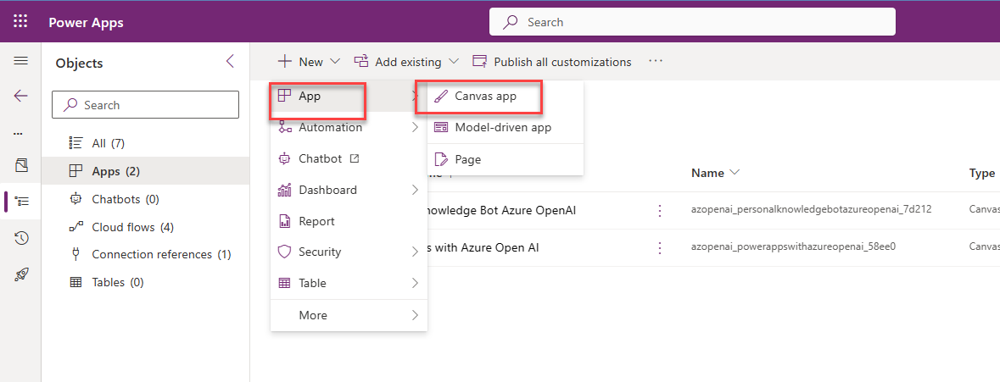

# 01 Simple Power Apps with Azure OpenAI Sample

In this example you will able to use Power Apps as front end for end users to ask question, then call Power Automate for Azure OpenAI service, the request come back to Power Automate and then anwer shown to end user. 

